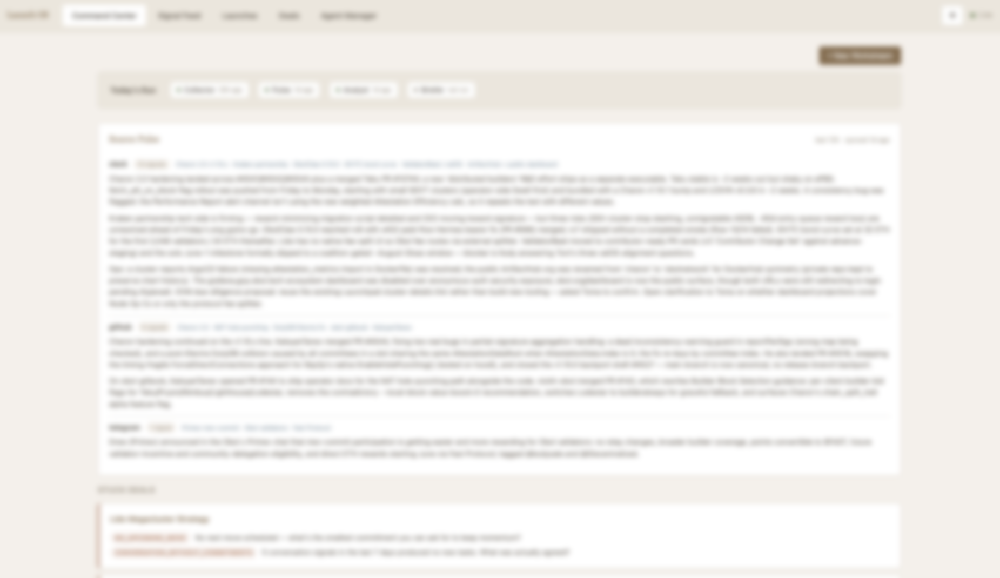
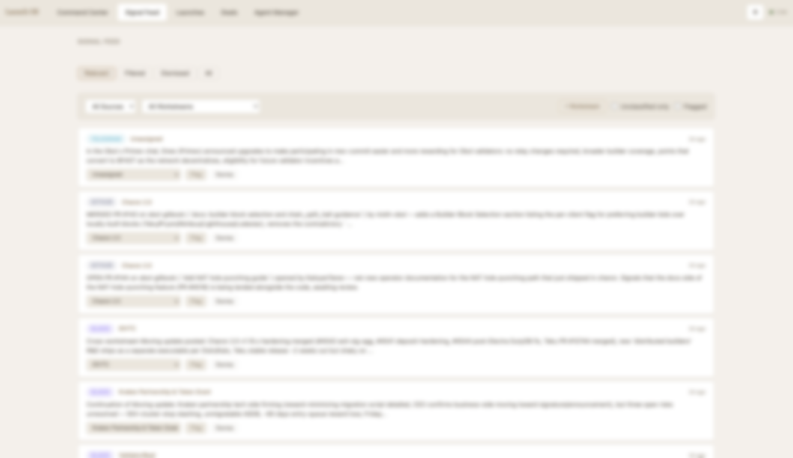
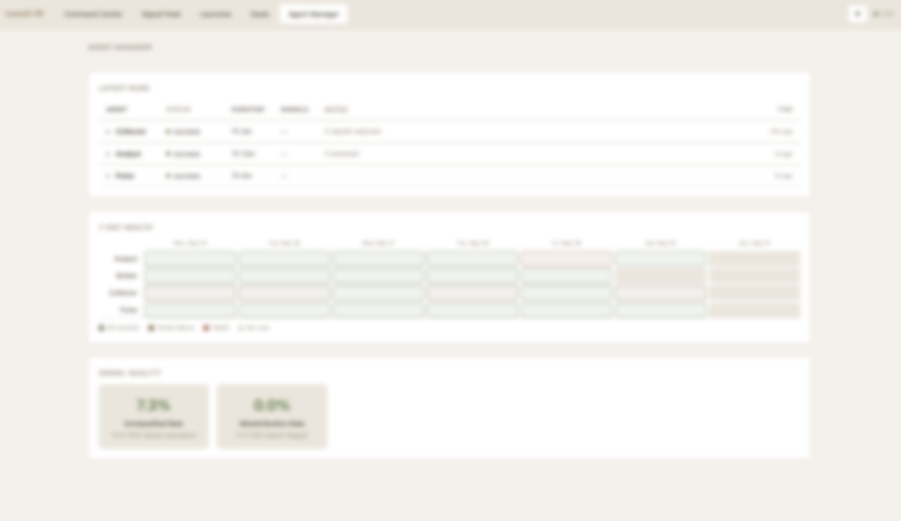
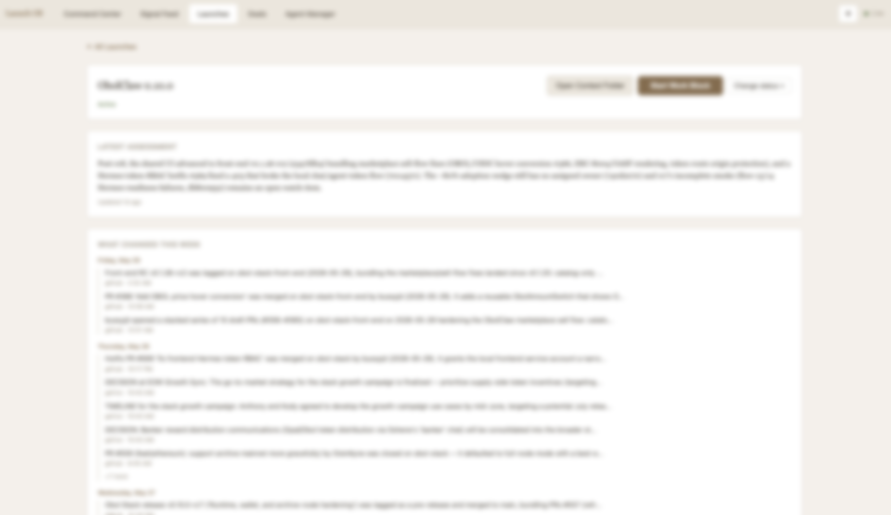

# Launch OS — An AI System That Runs Go-to-Market

> Portfolio write-up, built to live on kody.eth as a linkable proof piece for the resume.
> Short by design. Tone matches the Obol/Smoothly case studies: builder-first, plain, in my voice.

---

**Role:** Builder / user. **Timeframe:** March 2026 → current. **Stack:** TypeScript/Node · SQLite · Express · Claude Code CLI orchestration · runs locally on a Claude subscription, no API tokens.

I built an AI system that watches every launch and deal we have going, makes sense of it, and posts a daily brief to the team. The system runs twice a day to stay current, and it drafts with me, in my voice, not generic AI copy. I built it myself and it runs on my own machine.

## The problem

GTM work generates more context than any one person can keep up with. Every launch and every deal produces signal all day across Slack, Notion, Google Drive, GitHub, and Telegram. Decisions, blockers, partner replies, slipped timelines.

Most of it lives in someone's head or in posts within channels that get missed. Projects stall out quietly because no one noticed they stopped moving, and there's never one place that answers the only question that matters: where does everything actually stand?

## Why I built it

It comes from the same instinct that pulled me into Folding@home and solo staking. The goal is to let a small marketing team focus on the important work instead of constantly trying to stay up to date on every launch and deal. And it sits right on the agentic-economy frontier I already follow (ERC-8004 agent registries, x402 payments), which is exactly where the Obol Stack is headed.

## How it works — two machines

**1. The Context Engine** runs itself, twice a day at 8am and 8pm. Six agents in a row, each one reading from and writing to a shared database. No human in the loop:

- **Collector** pulls raw signal from five places (Slack, GitHub, Notion, Google Drive including meeting transcripts, and Telegram).
- **Relevance Filter** keeps the launch and deal stuff, throws out the noise, and gets sharper every time I correct it.
- **Pulse** writes up what each channel surfaced this cycle, source by source.
- **Analyst** ties each signal to the right workstream and calls where it stands, leading with what moved.
- **Briefer** posts the daily brief to our Slack, split into what's Moving and what's Stale.

**2. The Launch Producer** keeps me in the loop. When I need to brainstorm narrative, positioning, and key messages, or draft user-facing content, I open a session that's already loaded with everything on one workstream: every signal, the brand voice, past drafts, and where it stands today. Then we work the real artifacts together. Scope briefs, positioning, partner messaging. A voice layer trained on stuff I've already published keeps the drafts sounding like me instead of generic AI.

## Why it works

- **One place to look.** For me it's a single place to check, and the whole team gets a brief on every workstream once a day instead of digging through five tools.
- **It catches what's going stale.** When a workstream stops moving, the system says so, and projects that would've quietly died get a nudge.
- **It gets better the more I use it.** Every correction trains the filter and the attribution.
- **It writes, it doesn't just track.** The Producer turns all that context into positioning that sounds like me, which is where the real work happens.

## By the numbers (since March 2026)

- **10+ active launches** tracked (**~10 more** queued), plus a **$1B+ deal pipeline** across a multi-stage funnel (discovery → commercial terms → verbal close → integrating → live)
- **5 signal sources**, unified · runs **twice a day** · **daily** team brief
- **800+** automated tests · **solo** build · **local-only**, no cloud, no API tokens

## Hard parts

Telling real signal apart from channel noise. Keeping the drafts sounding like me and not like AI. Knowing when to leave a judgment call alone instead of automating it. Building something that lasts as a team of one.

---

*I built it to run Obol Network's launch and BD operations. It's the same surface a product marketing org runs, positioning, launch ops, deal pipeline, competitive signal, except it's software.*
